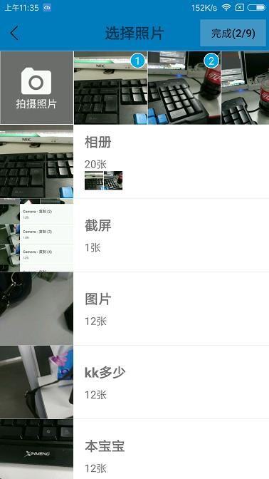
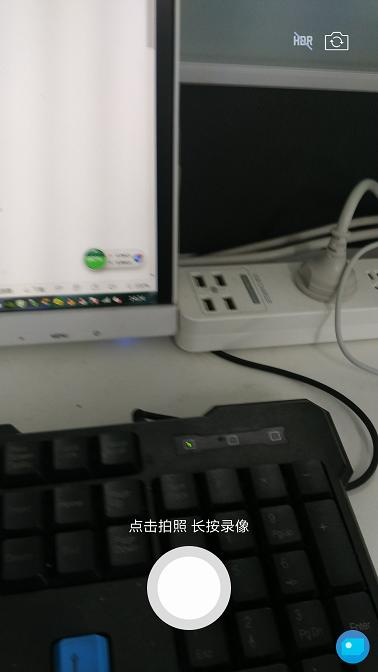
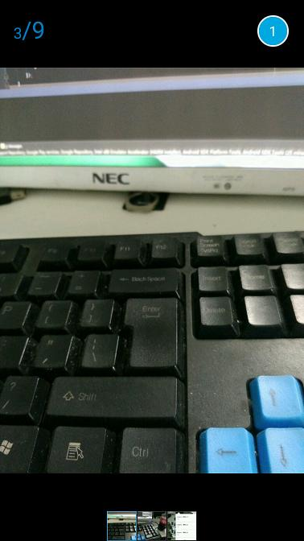

godlibrary-gallery
======================
[](https://www.apache.org/licenses/LICENSE-2.0)


# 简介
1. 相册选取图片，图片按照选择顺序排序
2. 图片预览
3. 点击拍照，长按录像


### Image


# dependencies

```html
dependencies {
    compile fileTree(include: ['*.jar'], dir: 'libs')
    compile 'com.android.support:support-v4:25.1.0'
    compile 'com.github.bumptech.glide:glide:3.7.0'
    compile 'com.sprylab.android.texturevideoview:texturevideoview:1.2.1'
    compile 'com.android.support:recyclerview-v7:25.1.0'
}
```

# 使用方法

## Stop1
```java
compile 'com.abook23:godlibrary-gallery:1.1'
```
## Stop2
```java
PhotoActivity.startActivityForResult(Activity ac, int checkMax, ArrayList<String> checkPath, int resultCode)
```
## 示例
```java
//PhotoActivity.CHECK_BUTTON_COLOR = R.color.;//选择按钮颜色
//PhotoActivity.COLOR_BACK_BUTTON = R.color.;// 顶部背景颜色
PhotoActivity.startActivityForResult(this, 9, null, 0)


@Override
protected void onActivityResult(int requestCode, int resultCode, Intent data) {
    super.onActivityResult(requestCode, resultCode, data);
        if (resultCode == RESULT_OK) {
            if (requestCode == 0) {
                ArrayList<String> list = data.getStringArrayListExtra(PhotoActivity.DATA);
                if (list.size() == 0) {
                    return;
                }
                StringBuffer sb = new StringBuffer();
                for (String s : list) {
                    sb.append("\n").append(s);
                }
                L.d(sb.toString());
            }
        }
    }
```
# 图片墙

```java
ImageInfoActivity.start(Context context, int position, ArrayList<String> urls)
```


## 自定义相机

```java
        CameraVideoFragment videoFragment = CameraVideoFragment.newInstance();
        //没特殊要求,sd 就可以了,HD 的视频有点大,微信就相当于SD模式
        videoFragment.setDefinition(CameraVideoFragment.Definition.SD);
        videoFragment.setVideoMaxDuration(60 * 1000);//最大录入时间,默认10s
        videoFragment.setVideoRatio(0.8f);//视频质量 ----微信视频 质量大概在 0.8f 左右, 要清晰一点,就调节大一些
        //videoFragment.setVideoMaxZie(50 * 1024 * 1024);//默认50MB
        videoFragment.setOnCameraVideoListener(new CameraVideoFragment.OnCameraVideoListener() {
            @Override
            public void onFragmentResult(String path, String type) {
                L.d(path);
            }
        });

        FragmentTransaction transaction = getSupportFragmentManager().beginTransaction();
        transaction.add(R.id.videoFragment, videoFragment);
        transaction.commit();
```



### Image



License
-------

    Copyright 2017 Wasabeef

    Licensed under the Apache License, Version 2.0 (the "License");
    you may not use this file except in compliance with the License.
    You may obtain a copy of the License at

       http://www.apache.org/licenses/LICENSE-2.0

    Unless required by applicable law or agreed to in writing, software
    distributed under the License is distributed on an "AS IS" BASIS,
    WITHOUT WARRANTIES OR CONDITIONS OF ANY KIND, either express or implied.
    See the License for the specific language governing permissions and
    limitations under the License.